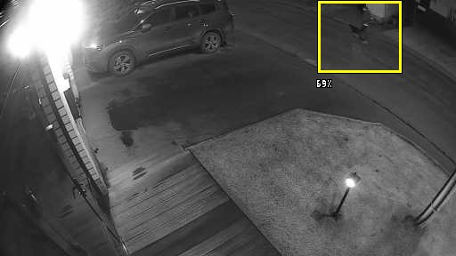
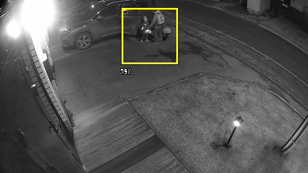

# Faceter

Integration with the Faceter project. 

The stack is split into lightweight daemons that can be deployed independently on OpenIPC cameras.

## faceter-agent

`faceter-agent` is the Faceter cloud integration utility—coming soon.

## faceter-detector

### Purpose

`faceter-detector` is a standalone utility for OpenIPC cameras. It listens to `majestic` motion messages via `logread`, pulls JPEG snapshots from the local HTTP endpoint (no RTSP/RTMP stream decoding), crops motion-driven ROIs, and runs them through a TensorFlow Lite Micro person model. The utility emits PERSON/MOTION events in ISO-8601 format and can optionally persist the evidence images.

### Key capabilities

- Two-stage pipeline: motion heuristics followed by a 96×96 TensorFlow Lite Micro inference.
- Adjustable thresholds, ROI export, and frame remapping for different sensors.
- Snapshot annotation (`--snapshot-rect`) and per-event labeling to aid triage.
- Motion-only fallback (`--disable-person-detector`) for devices without NEON.
- Snapshot and ROI folders are purged on startup to guarantee fresh data.
- Debug ROI dumps for dataset accumulation and `--debug-roi-logic` for blob traceability.

### Runtime dependencies

We ship ready-to-run binaries, so only runtime pieces must exist on the target firmware:

- `logread` (BusyBox) and `/bin/grep` for streaming `majestic` motion logs.
- Local HTTP snapshot endpoint (default `http://127.0.0.1/image.jpg`).
- `libjpeg.so.9.5.0` (or ABI‑compatible) available in the loader path.
- `libcurl.so` 4.x (the binary dlopens it under the names `libcurl.so.4.7.0`, `libcurl.so.4`, or `libcurl.so`; some vendors label it `lbicurl`).

### Quick start

```bash
scp faceter-detector root@camera:/usr/bin/
ssh root@camera 'chmod +x /usr/bin/faceter-detector'
ssh root@camera '/usr/bin/faceter-detector \
  --snapshot-url-creds admin:secret \
  --snapshot-url http://127.0.0.1/image.jpg \
  --snapshot-path /tmp/faceter-detector/snapshot'
```

Snapshots and 96×96 ROI dumps are automatically removed when the process starts, so point the options to directories dedicated to the detector.

### Automation example

A common integration scenario is to supervise the detector with a shell script:

1. Start `faceter-detector` in the background with `--snapshot-path /tmp/faceter-detector/snapshot`.
2. Tail stdout, wait for a `PERSON` line, and parse the `snapshot=...jpg` field.
3. Once a snapshot appears, copy it (e.g., via `scp` or `curl`) and push a notification to a messenger bot along with the probability and timestamp.

Because the detector writes each snapshot before printing the PERSON line, the script can safely download the referenced JPEG immediately, then relay both the image and event metadata to the user chat.

### Launch parameters

```
  -h, --help                     Show help and exit.
  --snapshot-url-creds USER:PASS Snapshot HTTP basic-auth creds (default root:12345).
  --snapshot-url URL             Snapshot HTTP base URL (default http://127.0.0.1/image.jpg).
  --person-thr FLOAT             PERSON probability threshold. Defaults: indoor 0.55, outdoor 0.40.
  --motion-thr FLOAT             MOTION confidence threshold (default 0.5).
  --processing_rate FLOAT        Snapshot fetches per second, 0.5–15 (default 7).
  --frame-w / --frame-h INT      Full-frame size for ROI remapping (default 1920×1080).
  --snapshot-path DIR            Full-frame snapshot directory (default /tmp/faceter-detector/snapshot).
  --snapshot-count INT           Number of snapshots to keep (default 4, newest retained).
  --snapshot-rect BOOL           Draw PERSON rectangles on saved snapshots (default true).
  --snapshot-rect-probe BOOL     Draw probability labels next to the bounding box (default false).
  --snapshot_motion BOOL         Persist MOTION snapshots even without PERSON (default false).
  --debug-save-img [DIR]         Dump 96×96 ROIs (default /tmp/faceter-detector).
  --disable-person-detector      Skip inference; watch motion only.
  --scene indoor|outdoor         Scene preset affecting filters and defaults (default indoor).
  --debug                        Verbose logging to stderr.
  --debug-roi-logic              Print blob selection diagnostics.
```

### Output format

Events are printed to stdout, one per line:

```
2025-11-24T08:02:39+00:00 PERSON prob=0.73 center=960,540 snapshot=/tmp/faceter-detector/snapshot/...
2025-11-24T08:02:45+00:00 MOTION 0.58
```

The `center` coordinates are reported in full-frame space. When snapshots are enabled, the path is appended to PERSON events so `faceter-agent` can forward it.

### Storage & housekeeping

- `--snapshot-path` stores annotated frames; `--debug-save-img` stores ROI crops.
- Both folders are created automatically and wiped during startup (`remove_all_snapshot_files`) to prevent stale evidence from being mixed with new detections.
- `cleanup_old_snapshots` keeps only the most recent `--snapshot-count` JPEGs, ensuring bounded flash usage.

### Sample detections

All detections in this gallery were captured outdoors. We keep daytime captures first so you can compare them against the night/low-light examples that follow.

**Day scenes**


**Night scenes**





### Computer vision pipeline

The detector uses a multi-stage ROI builder before inference:

#### Motion detection

- **Frame-to-frame difference:** consecutive gray frames are compared with a 5-level threshold. The image is processed block-wise (16×16) and flood-filled to form motion bounding boxes.
- **Adaptive background subtraction:** the background buffer lives in Q8 fixed-point form and is updated via exponential moving average (α = 1/16 outdoor, 1/8 indoor). Difference thresholds of 18/26 (outdoor/indoor) allow lighting adaptation.
- **Glare detection:** dominant brightness jumps that affect >70 % of pixels trigger a 12-frame cooldown to ignore rolling shutter flare.

#### Morphological operations

- **3×3 closing:** dilation followed by erosion smooths the binary mask. The implementation is NEON-optimized and handles 16 pixels per pass.

#### Blob detection

- **Connected components:** a stack-based flood-fill finds blobs that satisfy geometric constraints: min height 5 % of the frame, aspect ratio 0.08–1.25 (outdoor) / 0.10–1.10 (indoor), and area 0.15 %–65 % of the frame.
- **Geometry filtering:** blobs are sorted by height and expanded to match human proportions (aspect ratio ≈0.35). Indoor/outdoor presets adjust the horizontal/vertical expansion (×1.10–1.20 / ×1.05–1.12) and bias (0.45–0.65) to keep the head inside the ROI.

#### ROI processing

- **Bilinear interpolation:** ROIs are resized to 96×96. Weight tables for popular ROI sizes are cached (LRU, 32 entries) to avoid recomputation.
- **Sobel edge detection:** Gx/Gy gradients feed the edge energy score and the vertical-ratio heuristic, helping suppress ROI textures that are not human silhouettes.
- **RGB→grayscale:** conversion follows ITU-R BT.601 and is vectorized with NEON (`vmull_u8` + `vshrn_n_u16`), processing eight pixels per instruction.

#### False-positive filtering

- **Fast-move detector:** tracks ROI center movement; shifts ≥0.6× diagonal force an inference to avoid missing fast subjects.
- **Static ROI filter:** ROIs with <4 px displacement, <0.25 probability, and <2 % motion volume are considered static background and ignored.
- **Motion mask intersection:** indoor mode intersects the binary motion mask with the background-subtraction mask to filter shadows and flicker.

At this point every candidate ROI is normalized and pushed into the on-device person classifier. The model is a lightweight 96×96 RGB CNN distilled from the Visual Wake Words family and kept in float32 form, so probability thresholds map 1:1 to the logits we log. TensorFlow Lite Micro embeds the interpreter, operator kernels, and static tensor arena directly into the binary, so no runtime filesystem access is required—the detector simply provides the arena buffer and invokes the single-person detection graph on each ROI.

### Optimizations

- NEON SIMD paths cover RGB conversion, frame differencing, morphological closing, and model input normalization. The detector auto-detects NEON and falls back to scalar code otherwise.

### Debugging & operational tips

- Use `--debug` to log each pipeline stage to stderr.
- `--debug-roi-logic` prints why blobs were accepted or rejected.
- `--debug-save-img` is ideal for collecting ROI datasets for further model training.
- If `logread` or `libcurl` cannot be initialized the process exits immediately, so watch syslog for startup errors.

